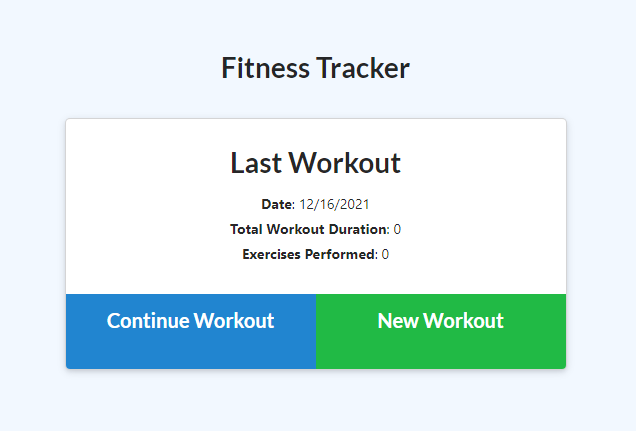
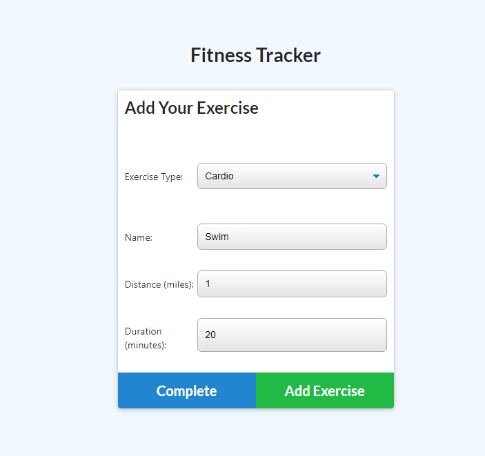
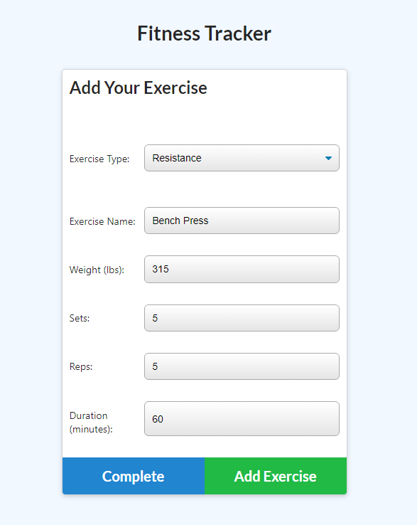
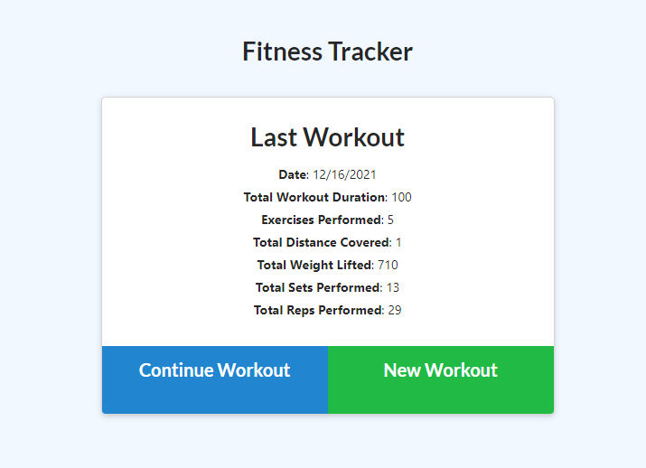
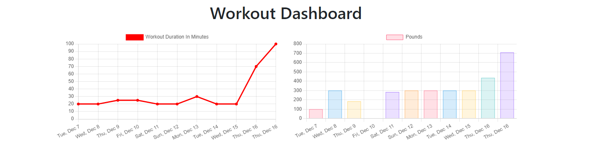

# Workout Tracker

https://secret-sands-32776.herokuapp.com/stats

https://github.com/mnguyen14/Workout-Tracker

# Table of Content
[Description](#Description)

[Installation](#Installation)

[Technologies](#Technologies)

[Usage](#Usage)

[License](#License)

[Contact](#Contact)

## Description
This app tracks your workouts.

## Installation
Run 'npm install' in your terminal

## Technologies

HTML

CSS

JavaScript

Node.js

Express.js

MongoDB

Mongoose

## Usage

Run 'npm run seed' and 'npm run start' in your terminal

or 

You can use the heroku link provided above.

Upon opening the app, you will be greeted with the homepage where you will have to create a new workout.

Then you can add exercise to your tracker like so 

Upon clicking complete workout it will bring you back to the homepage where you will get a summary of your workout.

You can also navigate to the dashboard tab on your navbar to get graphs of your previous workouts. They display the duration of which you've worked out and the sum of weight lifted for each workout session.

## License

## Contact
https://github.com/mnguyen14

Email: matthewnguyen0814@gmail.com